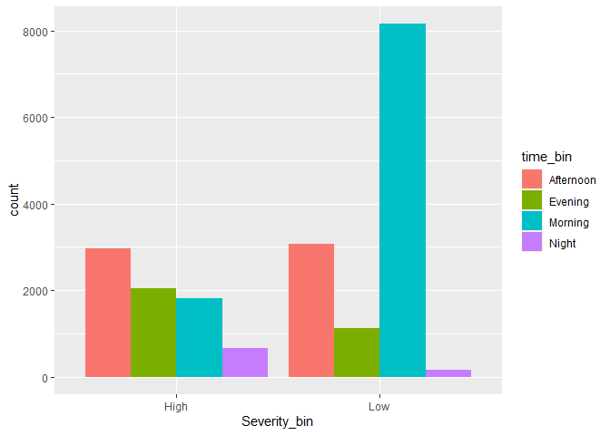
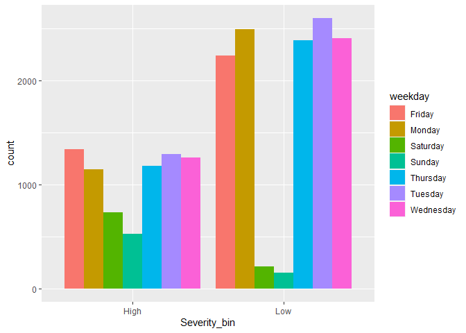
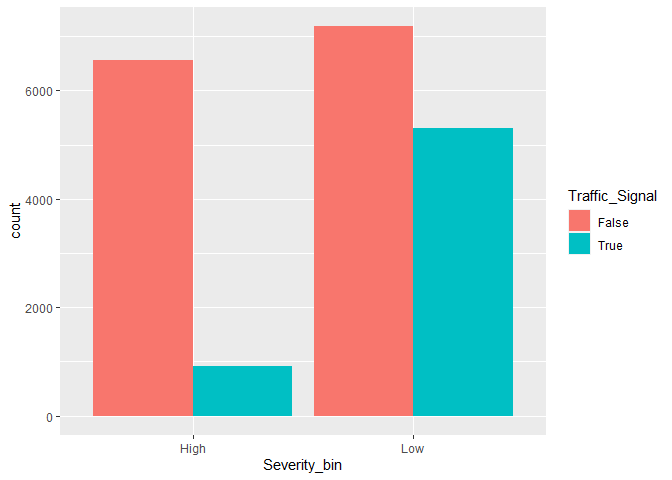
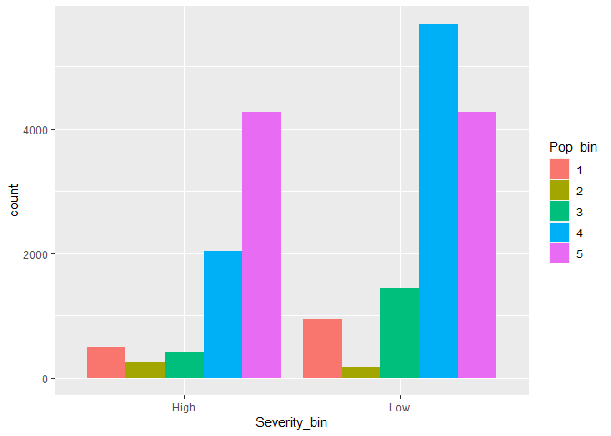
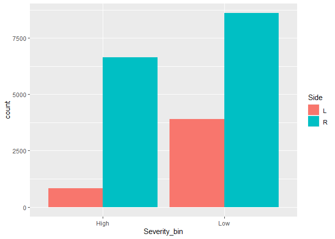

Predicting severity of car incident
================
Takeshi Oda
2020/5/4

## 1\. Introduction

In this project, I built a classification model to predict serious car
accident in the U.S. To do this, I used “US Accidents A Countrywide
Traffic Accident Dataset (2016 - 2019)” in Kaggle dataset.
(<https://www.kaggle.com/sobhanmoosavi/us-accidents>) This dataset
contains 2974335 observations about car accidents from February 2016 to
December 2019 across entire U.S. This data sets give us severity of car
accidents along with more than 40 variables such as location, weather,
conditions.

Using this data set, I attempted to present answer to the question:  
**How much would be the severity of the car accident when one car
accident happens? **

This dataset provides response variable Severity i.e., a number between
1 and 4, where 1 indicates the least impact on traffic (short delay) and
4 indicates a significant impact on traffic. (long delay)  
**I defined binary classification variable Severity\_bin i.e., “Low” for
Seveirty 1 and 2, “High” for Severity 3 and 4 and built a predictive
model to estimate probability to have “High” severity against specific
input of a street such as weather, time and road structure.**

I assume this model is used by public relation sector in a regional
government (county government) which is in charge of notifying car
accident in their web site or social media. Using the model, public
relation agents will be able to provide as accurate estimated time for
recovery as possible helping citizens take alternative way to the
destination.

**To narrow the scope of the model, I extracted accident data of
Illinois state in 2019 from original dataset. ** To enrich predictive
variable, I downloaded population data for each county in Illinois from
<https://www.illinois-demographics.com/counties_by_population> and
combined it with car accident data set.

## 2\. Data load and cleaning

To prepare dataset for data mining, I performed following data
cleanings.

### Missing value imputation

**Mean value was filled with missing value in following variables.**  
  Temperature  
  Humidity  
  Pressure  
  Visibility  
  Window Speed  
**Only one observations lacled the period of day (i.e. day or night) in
sunrise/sunset. civil twilight, nautical twilight and astronomical
twilight.I added ‘Day’ in following four variables.**  
  Sunrise\_Sunset  
  Civil\_Twilight  
  Nautical\_Twilight  
  Astronomical\_Twilight  
**Following varables are abandoned because proportio of missing value is
high.**  
  Wind\_Chill.F.  
  Precipitation.in.

### Correction of incosistent naming convention

Some **county name** was corrected to be consistent across dataset.

### Binning of continuous variables

This dataset contains several continuous variables. To reduce prediction
variance from outlier, I applied binning against following variables.

**Weather Condition**  
50 different weather conditions are categorized into 11 larger
categories.

**Starting Time**  
Each time of the accident is classified into Four categories: Morning,
Afternoon, Evening and Night.

**Temperature, Humidity, Pressure, Visibility, Window Speed**  
Those variables are transformed to four bins with equal in equal width.

**Population** Cook county has extremly large population 5,223,719
followed by Dupage county’s 931,743. Population of all counties except
for Cook county is classified into four bins. Cook county is classified
into fifth bin.

``` r
load("car_accidents_IL")
acc_il$Severity <- as.factor(acc_il$Severity)
#Read population by county
pop_cnty <- read.csv("pop_il.csv")
#Read weather classification file 
weather_class <- read.csv("weather_class.csv")

acc_il <- acc_il %>% left_join(weather_class, by="Weather_Condition")
```

    ## Warning: Column `Weather_Condition` joining character vector and factor,
    ## coercing into character vector

``` r
acc_il$Heavy.Rain[is.na(acc_il$Heavy.Rain)] <- 0
acc_il$Light.Rain[is.na(acc_il$Light.Rain)] <- 0
acc_il$Heavy.Wind[is.na(acc_il$Heavy.Wind)] <- 0
acc_il$Light.Wind[is.na(acc_il$Light.Wind)] <- 0
acc_il$Heavy.Snow[is.na(acc_il$Heavy.Snow)] <- 0
acc_il$Light.Snow[is.na(acc_il$Light.Snow)] <- 0
acc_il$Heavy.Storm[is.na(acc_il$Heavy.Storm)] <- 0
acc_il$Light.Storm[is.na(acc_il$Light.Storm)] <- 0
acc_il$Heavy.Thunder[is.na(acc_il$Heavy.Thunder)] <- 0
acc_il$Light.Thunder[is.na(acc_il$Light.Thunder)] <- 0
acc_il$Fog[is.na(acc_il$Fog)] <- 0

bin_size = 4

#Impute Sunrise_Sunset, Civil_Twilight, Nautical_Twilight, Astronomical_Twilight
acc_il$Sunrise_Sunset[acc_il$Sunrise_Sunset == ""] <- "Day"
acc_il$Civil_Twilight[acc_il$Civil_Twilight == ""] <- "Day"
acc_il$Nautical_Twilight[acc_il$Nautical_Twilight == ""] <- "Day"
acc_il$Astronomical_Twilight[acc_il$Astronomical_Twilight == ""] <- "Day"


#Add day of week
acc_il$weekday <- weekdays(as.Date(acc_il$Start_Time,'%Y-%m-%d'))

#Binning of Time
time <- as.character(acc_il$Start_Time)
hour <- as.integer(substring(time, 12, 13))
acc_il$time_bin <- ifelse(
    hour >= 6 & hour <= 11, "Morning",
    ifelse(
      hour <= 16, "Afternoon",
      ifelse(
        hour <= 20, "Evening", "Night"
      )
    )
  )

#Binning of temperature
#Replace NA with mean
tempF_mean <- mean(acc_il$Temperature.F., na.rm = TRUE)
acc_il$Temperature.F.[is.na(acc_il$Temperature.F.)] <- tempF_mean
tempF_min <- min(acc_il$Temperature.F.)
tempF_max <- max(acc_il$Temperature.F.)
tempF_range <- tempF_max - tempF_min

tempF_int <- ceiling(tempF_range / bin_size)

acc_il$Temperature_bin <- NA
for (i in 1:bin_size) {
  acc_il$Temperature_bin[is.na(acc_il$Temperature_bin) & acc_il$Temperature.F. <= tempF_min + i*tempF_int] <- as.character(i)
}

#Binning of Humidity
#Replace NA with mean
humid_mean <- mean(acc_il$Humidity..., na.rm = TRUE)
acc_il$Humidity...[is.na(acc_il$Humidity...)] <- humid_mean
#Binning
humid_min <- min(acc_il$Humidity...)
humid_max <- max(acc_il$Humidity...)
humid_range <- humid_max - humid_min

humid_int <- ceiling(humid_range / bin_size)

acc_il$Humidity_bin <- NA
for (i in 1:bin_size) {
  acc_il$Humidity_bin[is.na(acc_il$Humidity_bin) & acc_il$Humidity... <= humid_min + i*humid_int] <- as.character(i)
}

#Binning of Pressure
#Replace NA with mean
press_mean <- mean(acc_il$Pressure.in.  ,na.rm = TRUE)
acc_il$Pressure.in.[is.na(acc_il$Pressure.in.)] <- press_mean
#Binning
press_min <- min(acc_il$Pressure.in.)
press_max <- max(acc_il$Pressure.in.)
press_range <- press_max - press_min

press_int <- ceiling(press_range / bin_size)

acc_il$Pressure.in_bin <- NA
for (i in 1:bin_size) {
  acc_il$Pressure.in_bin[is.na(acc_il$Pressure.in_bin) & acc_il$Pressure.in. <= press_min + i*press_int] <- as.character(i)
}

#Binning of Visibility
#Replace NA with mean
vis_mean <- mean(acc_il$Visibility.mi.  ,na.rm = TRUE)
acc_il$Visibility.mi.[is.na(acc_il$Visibility.mi.)] <- vis_mean
#Binning
vis_min <- min(acc_il$Visibility.mi.)
vis_max <- max(acc_il$Visibility.mi.)
vis_range <- vis_max - vis_min

vis_int <- ceiling(vis_range / bin_size)

acc_il$Visibility.mi_bin <- NA
for (i in 1:bin_size) {
  acc_il$Visibility.mi_bin[is.na(acc_il$Visibility.mi_bin) & acc_il$Visibility.mi. <= vis_min + i*vis_int] <- as.character(i)
}

#Binning of Window Speed
#Replace NA with mean
winspd_mean <- mean(acc_il$Wind_Speed.mph.  ,na.rm = TRUE)
acc_il$Wind_Speed.mph.[is.na(acc_il$Wind_Speed.mph.)] <- winspd_mean
#Binning
winspd_min <- min(acc_il$Wind_Speed.mph.)
winspd_max <- max(acc_il$Wind_Speed.mph.)
winspd_range <- winspd_max - winspd_min

winspd_int <- ceiling(winspd_range / bin_size)

acc_il$Wind_Speed.mph_bin <- NA
for (i in 1:bin_size) {
  acc_il$Wind_Speed.mph_bin[is.na(acc_il$Wind_Speed.mph_bin) & acc_il$Wind_Speed.mph. <= winspd_min + i*winspd_int] <- as.character(i)
}


#Clean Country name
#DuPage -> Dupage
#McHenry -> Mchenry
#LaSalle -> La Salle
#McLean -> Mclean
#DeKalb -> Dekalb
#Dewitt -> De Witt
#Saint Clair -> St. Clair
acc_il <- acc_il %>% mutate(County = ifelse(County == "DuPage", "Dupage", County))
acc_il <- acc_il %>% mutate(County = ifelse(County == "McHenry", "Mchenry", County))
acc_il <- acc_il %>% mutate(County = ifelse(County == "LaSalle", "La Salle", County))
acc_il <- acc_il %>% mutate(County = ifelse(County == "DeKalb", "Dekalb", County))
acc_il <- acc_il %>% mutate(County = ifelse(County == "Dewitt", "De Witt", County))
acc_il <- acc_il %>% mutate(County = ifelse(County == "Saint Clair", "St. Clair", County))
acc_il <- acc_il %>% mutate(County = ifelse(County == "McLean", "Mclean", County))


#Add county population
#Binning county population
#Divide all the counties except for Cook county into four classes
pop_cnty <- pop_cnty %>% mutate(Pop_bin = ifelse(
                                              Population <= 231647, "1", 
                                                    ifelse(Population <= 463294, "2",
                                                        ifelse(Population <= 694941, "3",
                                                            ifelse(Population < 5223719, "4",
                                                            "5")
                                                        )
                                                    )
                                        )
                      )

acc_il <- acc_il %>% left_join (pop_cnty, by="County")
```

    ## Warning: Column `County` joining character vector and factor, coercing into
    ## character vector

``` r
acc_il$Pop_bin[is.na(acc_il$Pop_bin)] <- "9"

#Add response variable Severity_Bin (0: Low, 1: High)
acc_il <- acc_il %>% mutate(Severity_bin = ifelse(Severity == "1" | Severity == "2", "Low", "High"))
```

## 3\. Exploratory Data Analysis

To find any patterns in correlation of Severity with predictive
variables, data visualization is performed.

### Key Findings

**Serious accident is most likely to happen in the afternoon while light
accident is much more likely to happen in the monring.**

``` r
#Severity and Time
gf_bar(~Severity_bin, fill=~time_bin, position = position_dodge(), data=acc_il, main="Severity and Time")
```

<!-- -->

**Serious accident is more likely to happen on weekend.**

``` r
#Severity and day of week
gf_bar(~Severity_bin, fill=~weekday, position = position_dodge(), data=acc_il, main="Severity and Day of Week")
```

<!-- -->

**Proportion of non traffic signal is much higher in serious accident
than light accident**

``` r
#Severity and existance of Traffic Signal
gf_bar(~Severity_bin, fill=~Traffic_Signal, position = position_dodge(), data=acc_il, main="Severity and Traffic Signal")
```

<!-- -->

**Proportion of Cook county is high in serious accident.**

``` r
#Severity and Population
gf_bar(~Severity_bin, fill=~Pop_bin, position = position_dodge(), data=acc_il, main="Severity and Population")
```

<!-- -->
**Accidents are frequent in right side of the street. But serious
accident is much more frequent in right side than light accident.**

``` r
gf_bar(~Severity_bin, fill=~Side, position = position_dodge(), data=acc_il, main="Severity and Side")
```

<!-- -->

## 4\. Model Selection

### Candidates algorithms

In this project, I took an approach to **balance between predictive
accuracy and model interpretation.** While the model should provide high
capability to predict serious car accident, it should enable local
government to gain insight into hidden factors of serious car accidents.
Therefore, I chose three classification methods, **Logistics Regression,
Bagging and Random Forest**. With Logistics Regression, log of odds
ratio of being serious car accident is modeled as linear combination of
each variable. Bagging and Random Forest allow us to quantify importance
of predictive variables through Variable Importance plot.

### Variable used

Following variables were included in predictive variables  
  Side  
  Amenity  
  Crossing  
  Junction  
  No\_Exit  
  Railway  
  Station  
  Stop  
  Traffic\_Signal  
  Sunrise\_Sunset  
  Civil\_Twilight  
  Nautical\_Twilight  
  Astronomical\_Twilight  
  weekday  
  time\_bin  
  Temperature F  
  Humidity  
  Pressure in  
  Visibility mi  
  Wind\_Speed mph  
  Population  
  Temperature\_bin  
  Humidity\_bin  
  Pressure in\_bin  
  Visibility mi\_bin  
  Wind\_Speed mph\_bin  
  Pop\_bin  
  Heavy Rain  
  Light Rain  
  Heavy Wind  
  Light Wind  
  Heavy Snow  
  Light Snow  
  Heavy Storm  
  Light Storm  
  Heavy Thunder  
  Light Thunder  
  Fog

### Model selection method

To select best model among three algorithms, cross validation was
performed on training data set. **Training data set is split into four
folds and model fitting and prediction are performed for each fold**.
Model which achieves least error rate across four folds is selected as
best model.

### Best Model

**Random Forest** achieved least **cross validation error rate 0.22**
restricting **9 variables** per tree.  
This means the model explain around 78 percent of variation of
severity.  
From variable importance plot, following five variables are identified
as strong predictor.  
 Time  
 Presence of Traffic Signal near by the location  
 Day of Week  
 Population  
 Relative side of the street

``` r
#Create tidy data set for modeling

#Exclude following variables
#ID
#Source
#TMC
#Start_Time
#End_Time
#Start_Lat
#Start_Lng
#End_Lat
#End_Lng
#Distance.mi.
#Description
#Number
#Street
#City
#County
#State
#Zipcode
#Country
#Timzezone
#Airport_Code
#Weather_Timestamp
#Temperature.F.
#Wind_Chill.F.
#Humidity...
#Pressure.in.
#Visibility.mi.
#Wind_Speed.mph.
#Precipitation.in.


acc_il_tidy <- acc_il %>% select(Severity_bin,
                                 Side,
                                 Amenity,
                                 Bump,
                                 Crossing,
                                 Give_Way,
                                 Junction,
                                 No_Exit,
                                 Railway,
                                 Roundabout,
                                 Station,
                                 Stop,
                                 Traffic_Calming,
                                 Traffic_Signal,
                                 Turning_Loop,
                                 Sunrise_Sunset,
                                 Civil_Twilight,
                                 Nautical_Twilight,
                                 Astronomical_Twilight,
                                 weekday,
                                 time_bin,
                                 
                                 # Only for Logistic Regression
                                 Temperature.F.,
                                 Humidity...,
                                 Pressure.in.,
                                 Visibility.mi.,
                                 Wind_Speed.mph.,
                                 Population,
                                 
                                 # Only for Bagging and Random Forest
                                 Temperature_bin,
                                 Humidity_bin,
                                 Pressure.in_bin,
                                 Visibility.mi_bin,
                                 Wind_Speed.mph_bin,
                                 Pop_bin,
                                 
                                 Heavy.Rain,
                                 Light.Rain,
                                 Heavy.Wind,
                                 Light.Wind,
                                 Heavy.Snow,
                                 Light.Snow,
                                 Heavy.Storm,
                                 Light.Storm,
                                 Heavy.Thunder,
                                 Light.Thunder,
                                 Fog)

acc_il_tidy$Severity_bin <- as.factor(acc_il_tidy$Severity_bin)
acc_il_tidy$Side <- as.factor(acc_il_tidy$Side)
acc_il_tidy$Amenity <- as.factor(acc_il_tidy$Amenity)
acc_il_tidy$Bump <- as.factor(acc_il_tidy$Bump)
acc_il_tidy$Crossing <- as.factor(acc_il_tidy$Crossing)
acc_il_tidy$Give_Way <- as.factor(acc_il_tidy$Give_Way)
acc_il_tidy$Junction <- as.factor(acc_il_tidy$Junction)
acc_il_tidy$No_Exit <- as.factor(acc_il_tidy$No_Exit)
acc_il_tidy$Railway <- as.factor(acc_il_tidy$Railway)
acc_il_tidy$Roundabout <- as.factor(acc_il_tidy$Roundabout)
acc_il_tidy$Station <- as.factor(acc_il_tidy$Station)
acc_il_tidy$Stop <- as.factor(acc_il_tidy$Stop)
acc_il_tidy$Traffic_Calming <- as.factor(acc_il_tidy$Traffic_Calming)
acc_il_tidy$Traffic_Signal <- as.factor(acc_il_tidy$Traffic_Signal)
acc_il_tidy$Turning_Loop <- as.factor(acc_il_tidy$Turning_Loop)
acc_il_tidy$Sunrise_Sunset <- as.factor(acc_il_tidy$Sunrise_Sunset)
acc_il_tidy$Civil_Twilight <- as.factor(acc_il_tidy$Civil_Twilight)
acc_il_tidy$Nautical_Twilight <- as.factor(acc_il_tidy$Nautical_Twilight)
acc_il_tidy$Astronomical_Twilight <- as.factor(acc_il_tidy$Astronomical_Twilight)
acc_il_tidy$weekday <- as.factor(acc_il_tidy$weekday)
acc_il_tidy$time_bin <- as.factor(acc_il_tidy$time_bin)
acc_il_tidy$Temperature_bin <- as.factor(acc_il_tidy$Temperature_bin)
acc_il_tidy$Humidity_bin <- as.factor(acc_il_tidy$Humidity_bin)
acc_il_tidy$Pressure.in_bin <- as.factor(acc_il_tidy$Pressure.in_bin)
acc_il_tidy$Visibility.mi_bin <- as.factor(acc_il_tidy$Visibility.mi_bin)
acc_il_tidy$Wind_Speed.mph_bin <- as.factor(acc_il_tidy$Wind_Speed.mph_bin)
acc_il_tidy$Pop_bin <- as.factor(acc_il_tidy$Pop_bin)

#split dataset into training and validation
set.seed(7, sample.kind = "Rounding")
```

    ## Warning in set.seed(7, sample.kind = "Rounding"): non-uniform 'Rounding' sampler
    ## used

``` r
inTrain <- createDataPartition(y=acc_il_tidy$Severity_bin, times=1, p=0.7)[[1]]

acc_il_tidy.tree <- acc_il_tidy %>% select(
                                  -c("Temperature.F.",
                                    "Humidity...",
                                    "Pressure.in.",
                                    "Visibility.mi.",
                                    "Wind_Speed.mph.",
                                    "Population",
                                    "Give_Way",
                                   "Roundabout",
                                   "Traffic_Calming",
                                   "Bump",
                                   "Turning_Loop")
)

acc_il_tidy.lm <- acc_il_tidy %>% select(
                                -c("Temperature_bin",
                                   "Humidity_bin",
                                   "Pressure.in_bin",
                                   "Visibility.mi_bin",
                                   "Wind_Speed.mph_bin",
                                   "Pop_bin",
                                   "Give_Way",
                                   "Roundabout",
                                   "Traffic_Calming",
                                   "Bump",
                                   "Turning_Loop"))

acc_il_tidy.lm <- acc_il_tidy.lm %>% mutate(Severity_bin = ifelse(Severity_bin == "High", 1, 0))


acc_train <- acc_il_tidy.tree[inTrain,]
acc_valid <- acc_il_tidy.tree[-inTrain,]

acc_train.lm <- acc_il_tidy.lm[inTrain,]
acc_valid.lm <- acc_il_tidy.lm[-inTrain,]


n <- nrow(acc_train)
k <- 4
groups <- c( rep(1:k, floor(n/k)) )
tmp <-   (n-floor(n/k)*k)
if ( tmp > 0 ) {
  groups <- c(groups, 1:tmp)
}
            


cvgroups <- sample(groups, n)
bag.predict <- acc_train$Severity_bin
rf.predict <- acc_train$Severity_bin
lm1.predict <- acc_train.lm$Severity_bin

#CV for bagging
for (i in 1:k){
  groupi <- (cvgroups == i)
  #Bagging
  bag <- randomForest(Severity_bin~.,
                        data=acc_train[!groupi,],
                        importance = T,
                        mtry=length(names(acc_train))-1)

  bag.predict[groupi] <- predict(bag,
                                   newdata=acc_train[groupi,],
                                   type="response")


}
bagcv <- sum( bag.predict !=  acc_train$Severity_bin) / n


#Random Forest
minPar <- 6
maxPar <- 20
num_var  <- seq(from=minPar, to=maxPar)
rfcv <- rep(NA, maxPar-minPar+1)
for (h in num_var) {


  for (i in 1:k){
    groupi <- (cvgroups == i)

      rf <-  randomForest(Severity_bin~.,
                            data=acc_train[!groupi,],
                            importance = T,
                            mtry=h)

      rf.predict[groupi] <- predict(rf,
                                      newdata=acc_train[groupi,],
                                      type="response")

  }
  rfcv[h-minPar+1] <- sum( rf.predict !=  acc_train$Severity_bin) / n
}


rfcv_min <- min(rfcv)[1]
optm_num_var <- num_var[which.min(rfcv)]


#CV for Logistic Regression
for (i in 1:k){
  groupi <- (cvgroups == i)
  
  lm1 <-  glm(Severity_bin~.,
                        data=acc_train.lm[!groupi,],
                        family="binomial"
                        )
      
  lm1.predict[groupi] <- predict(lm1,
                                    newdata = acc_train.lm[groupi,],
                                    type="response")   
   
}
```

    ## Warning in predict.lm(object, newdata, se.fit, scale = 1, type = if (type == :
    ## prediction from a rank-deficient fit may be misleading

    ## Warning in predict.lm(object, newdata, se.fit, scale = 1, type = if (type == :
    ## prediction from a rank-deficient fit may be misleading
    
    ## Warning in predict.lm(object, newdata, se.fit, scale = 1, type = if (type == :
    ## prediction from a rank-deficient fit may be misleading
    
    ## Warning in predict.lm(object, newdata, se.fit, scale = 1, type = if (type == :
    ## prediction from a rank-deficient fit may be misleading

``` r
lm1.roc <- roc(response=acc_train.lm$Severity_bin,  predictor = lm1.predict)
```

    ## Setting levels: control = 0, case = 1

    ## Setting direction: controls < cases

``` r
#plot(lm1.roc)
#auc(lm1.roc)

#Find optimum threshold
thshd <- seq(from = 0.01, to = 1, by = 0.01)
error_rt <- rep(0, length(thshd))
for (i in 1:length(thshd)){
  mtx <- table(lm1.predict > thshd[i], acc_train.lm$Severity_bin)
  if (dim(mtx)[1] == 1) {
    error_rt[i] <- (mtx[1,2]) / sum(mtx)
  }else {
    error_rt[i] <- (mtx[1,2] + mtx[2,1]) / sum(mtx)
  }
}

#Print model cross validation performance
print(paste0("CV rate of Bagging model is :", round(bagcv,2)))
```

    ## [1] "CV rate of Bagging model is :0.24"

``` r
print(paste0("CV rate of Random Forest model is :", round(rfcv_min,2)))
```

    ## [1] "CV rate of Random Forest model is :0.21"

``` r
lm1cv <- min(error_rt)
print(paste0("CV rate of Logistic Regression model is:", round(lm1cv,2)))
```

    ## [1] "CV rate of Logistic Regression model is:0.23"

``` r
min_thshd <- thshd[which.min(error_rt)]
print(paste0("Optimum threshhold  of Logistic Regression Model is:", min_thshd))
```

    ## [1] "Optimum threshhold  of Logistic Regression Model is:0.49"

``` r
all_cv <- c(bagcv, rfcv_min, lm1cv)
model_name <- c("Bagging Model", "Random Forest Model", "Logistic Regression Model")

print(paste0("Selected Model is : ", model_name[which.min(all_cv)]))
```

    ## [1] "Selected Model is : Random Forest Model"

``` r
plot(num_var, rfcv, main="CV rate by number of variable per split (Random Forest)")
```

<!-- -->

``` r
varImpPlot(rf, main="Variable Importance (Random Forest)", cex=0.6)
```

<!-- -->

``` r
print(paste0("Optimum number of variables per split is:", num_var[which.min(rfcv)]))
```

    ## [1] "Optimum number of variables per split is:8"

## 5\. Model Validation

As a final step of predictive modeling, prediction error rate is
measured. Random forest model with number of variable = 9 is fitted on
all the training data set and prediction is performed on validation set.
**Final model achieved prediction error rate 0.21**.

``` r
n.valid <- nrow(acc_valid)
rf.best.predict <- acc_valid$Severity_bin

rf.best <-  randomForest(Severity_bin~.,
                            data=acc_train,
                            importance = T,
                            mtry=optm_num_var)

rf.best.predict <- predict(rf.best,
                              newdata=acc_valid,
                              type="response")

error.valid <- sum( rf.best.predict !=  acc_valid$Severity_bin) / n.valid


print(paste0("Validation Error rate of Random Forest is:", round(error.valid,2)))
```

    ## [1] "Validation Error rate of Random Forest is:0.2"
